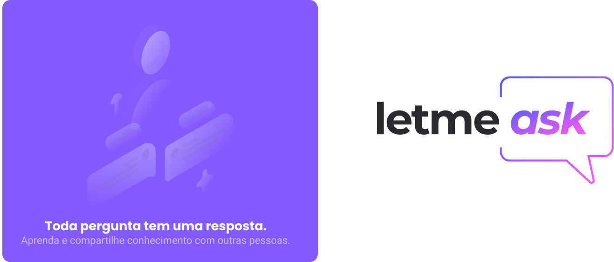
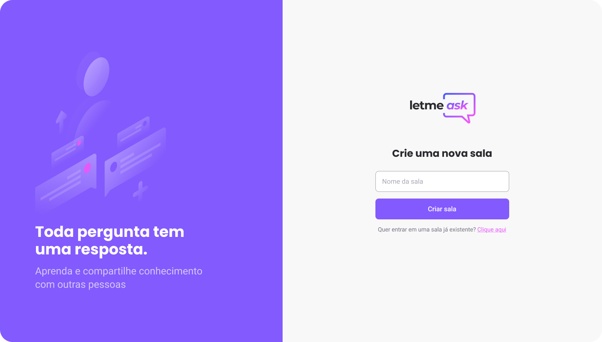
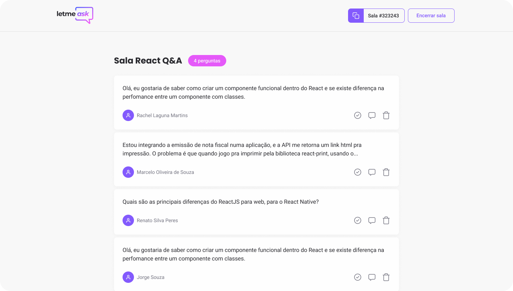
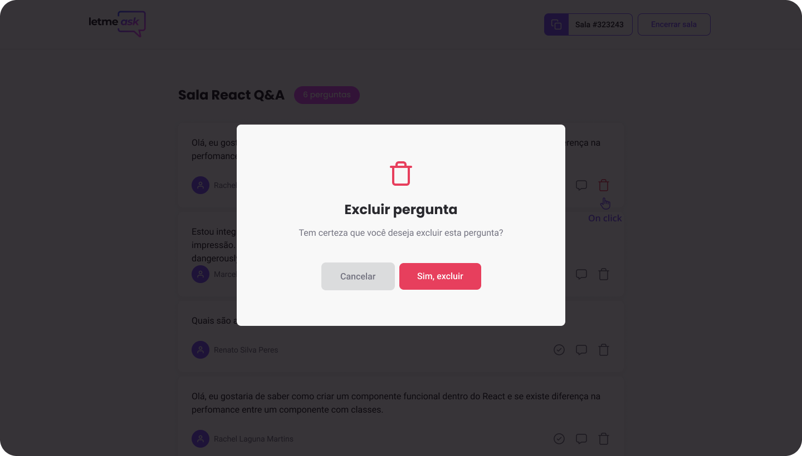

  
  

  
  
  

<h1 id="title" align="center">📖 Letmeask NLW Together</h1>

NLW é um evento inédito, gratuito e é disponibilizado pela <a href="https://rocketseat.com.br/">Rockeatset</a>, uma empresa onde o foco é te ajudar a evoluir na programação, todo ano eles liberam eventos inéditos que podem te ajudar bastante a evoluir mesmo você sendo um profissional ou um iniciante na área. Nessa edição, ao se cadastrar, você teria a oportunidade de escolher 7 trilhas, são elas, ReactJS para <b>Front End</b>, React Native e Flutter para <b>Mobile</b>, Node.js e Elixir para <b>Back End</b> e Discover e Origin para <b>Iniciantes</b>.

Nessa edição resolvi escolher a trilha ReactJS por que me identifico com Front End e gosto muito de criar telas, A proposta do Diego(professor da trilha ReactJS) foi criar uma aplicação que tem como foco responder perguntas e dúvidas em palestras ou em eventos ao vivo, a aplicação teve o nome Leatmeask pois do inglês ficaria (Deixe-me Perguntar), começamos a codar nossa aplicação no Domingo(20/06/2021) e terminamos na Quinta(24/06/2021), essa foi uma semana muito produtiva e de muito código e como sempre faço nos eventos, usei o <a href="https://notion.so">Notion</a> como bloco de anotações.

Sempre participo das edições da NLW e sempre saio com muito aprendizado e conhecimento a mais, então se voce é um apaixonado pela programação e quer se tornar um programar de sucesso ou até já está trabalhando na área, te recomendo muito a se cadastrar na <a href="https://rocketseat.com.br/">Rockeatset</a> para ficar pode dentro de todos os eventos que eles disponibilizam.

<h2 id="summary">📚 Conteúdo</h2>

* [Sobre](#title)
* [Conteúdo](#summary)
* [Preview do Projeto](#preview)
* [Tecnologias](#technologies)

<h2 id="preview">🔎 Preview do Projeto (Clique na imagem para ver em tamanho real)</h2>

  
  

  
  

 Projeto Completo No Figma: https://www.figma.com/file/1Z8COHzPi2FwWAwBbVnjsH/Letmeask?node-id=45%3A3279

<h2 id="technologies">🛠 Tecnologias</h2>

As seguintes ferramentas foram usadas na construção do projeto:

- [Node.js](https://nodejs.org/en/)
- [ReactJS](https://pt-br.reactjs.org/)
- [SASS](https://sass-lang.com/)
- [Firebase](https://firebase.google.com/)
